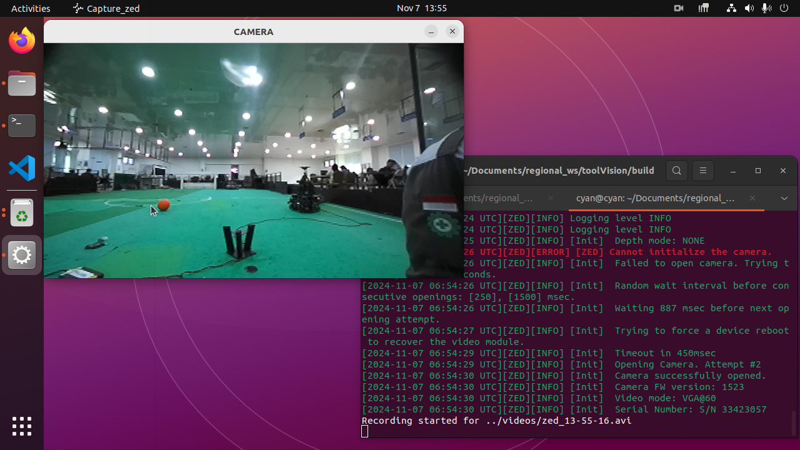
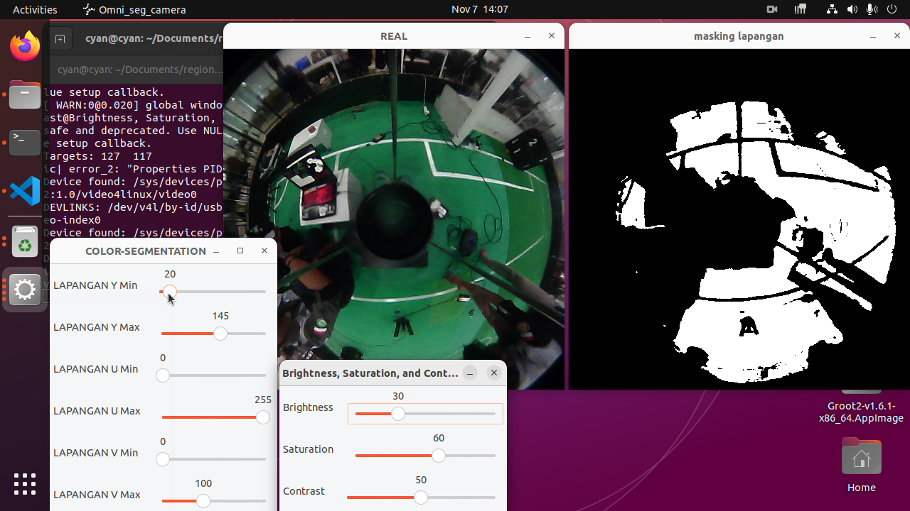
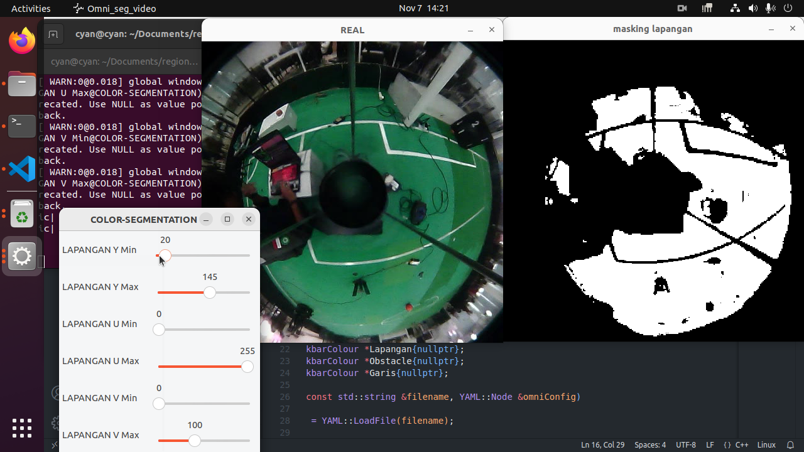

<h1 style="text-align: center;"><strong>TOOLVISION</strong></h1>

"toolVision" adalah sebuah package yang digunakan untuk melakukan capture dan pengaturan parameter untuk sistem vision pada robot.
sebelum menggunakan package ini pastikan telah menginstal:

1. [Opencv](https://barelang63-brail.github.io/Barelang63-Dokumentasi/INSTALL/install_opencv/)

2. [CUDA](https://barelang63-brail.github.io/Barelang63-Dokumentasi/INSTALL/cuda_and_cudnn/)

3. [ZED SDK](https://barelang63-brail.github.io/Barelang63-Dokumentasi/INSTALL/zed_sdk_install/)

4. [Other Dependencies](https://barelang63-brail.github.io/Barelang63-Dokumentasi/INSTALL/install_all/#instalasi-library-untuk-robot)

anda dapat mengclone package "toolVision" dengan command:
```{ .sh .copy }
git clone https://github.com/dsyahput/toolVision.git
```
Dalam package toolVision, struktur folder akan tersusun sebagai berikut:
```
toolVision/
│
├── include/
│   |
│   └── ..        
├── src/
│   ├── lib/
│   │   |
│   │   └── ..
│   └── ..    
├── videos/ 
|   |  
│   └── ..         
└── CMakeLists.txt
```

Untuk menggunakan package ini, pertama-tama build package dengan langkah berikut:
```{ .sh .copy }
cd toolVision
mkdir build
cd build
cmake ..
make 
```

setelah package di build terdapat 4 executable yang dapat digunakan di antaranya:

## **capture_omni**
Dengan menjalankan executable ini, Anda dapat membuka kamera omni yang terdapat pada robot:

```{ .sh .copy }
./capture_omni
```


Saat menjalankan executable ini, trackbar untuk mengatur brightness, saturation, dan contrast juga akan muncul. Sesuaikan nilai-nilai tersebut sesuai kebutuhan Anda.

Untuk memulai merekam, ikuti langkah-langkah berikut:

1. Tekan tombol 's' untuk mulai merekam video.

2. Tekan tombol 'x' untuk menghentikan rekaman.

3. Tekan tombol 'ESC' untuk keluar dari program.

Video yang direkam akan tersimpan di dalam folder **videos**.

## **capture_zed**
Executable ini memiliki fungsi yang sama seperti executable **./capture_omni**, namun digunakan untuk membuka kamera ZED pada robot:

```{ .sh .copy }
./capture_zed
```



Untuk memulai merekam, ikuti langkah-langkah berikut:

1. Tekan tombol 's' untuk mulai merekam video.

2. Tekan tombol 'x' untuk menghentikan rekaman.

3. Tekan tombol 'ESC' untuk keluar dari program.

Video yang direkam akan tersimpan di dalam folder **videos**.

## **omni_seg_camera**
Saat executable ini dijalankan, kamera omni yang terdapat pada robot akan terbuka. Fungsi utamanya adalah untuk mengatur parameter-parameter seperti brightness, contrast, serta parameter segmentasi warna yang terdapat pada robot:
```{ .sh .copy }
./omni_seg_camera <nomor_masking>
```
```
<Nomor Masking>
0: Masking Garis
1: Masking Lapangan
2: Masking Obstacle
```


Setelah executable dijalankan, Anda dapat mengatur parameter untuk vision pada robot. Sesuaikan parameter tersebut sesuai dengan kebutuhan, kemudian tekan "s" untuk menyimpan parameter yang telah diatur ke dalam file konfigurasi yang terdapat pada robot.

## **omni_seg_video**
Mirip dengan executable **./omni_seg_camera**, namun executable ./omni_seg_video hanya berfungsi untuk mengatur parameter segmentasi warna yang terdapat pada robot. Berbeda dengan **./omni_seg_camera**, executable ini tidak membuka kamera omni pada robot, melainkan video:
```{ .sh .copy }
./omni_seg_video <nomor_masking>
```
```
<Nomor Masking>
0: Masking Garis
1: Masking Lapangan
2: Masking Obstacle
```


Pada executable ini, parameter yang dapat diatur hanya untuk segmentasi warna. Pastikan untuk menyesuaikan path video Anda pada program **src/omni_seg_video.cpp**. Anda tidak dapat mengatur parameter brightness, saturation, dan contrast, karena executable ini membuka video, sehingga pengaturan tersebut hanya diperlukan saat merekam video dengan **./capture_omni**.
